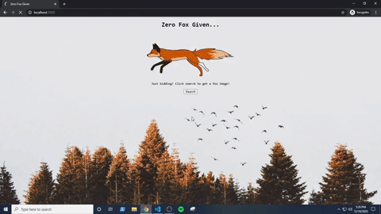

This project fetches a random fox image from a fox image API and uploads it to a user's Imgur account.
Authorization model used to verify our application - OAuth 2.0 Three-legged. 

Fox Image API - https://randomfox.ca/
Imgur API - https://apidocs.imgur.com/

Please note that the main2.html file is needed to run the Imgur API properly. 
Without it, the user won't be able to move past the login screen after they pass in their credentials. 

Demonstration: 

